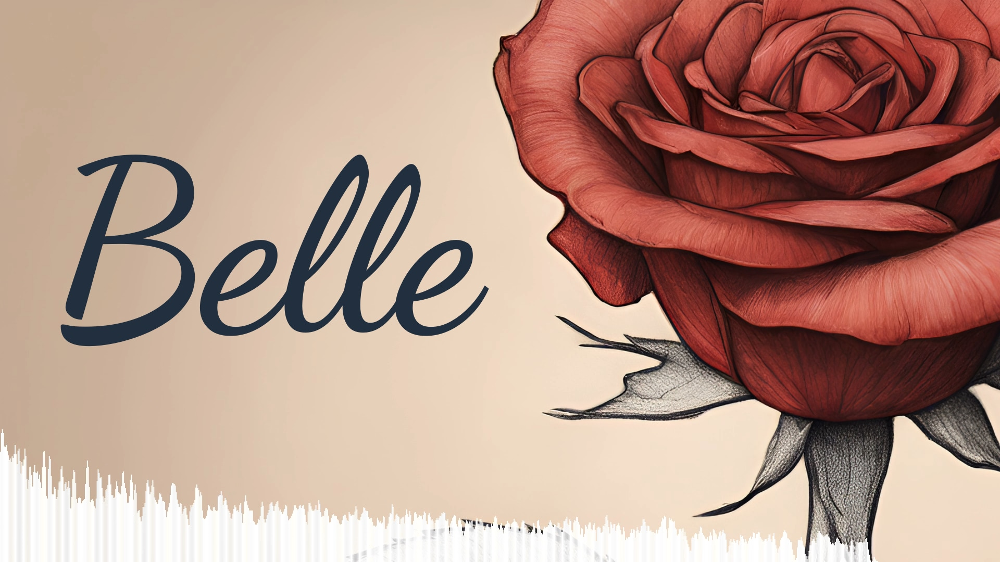

# Audio spectrum visualizer

This project's aim is to visualize audio spectrum and record it as a video.
This is useful for music-video visualization.

The resultant video looks like this:

where you can see the audio spectrum as white
bars in the bottom with an image in the background.

# Video format

The project captures video and outputs it in the `webm` format. After some experimentation, I have
found that Firefox uses VP8 codec for the video,
at least under macOS, while Safari uses H.264.
You can see the actual code using `Media information` menu command in VLC.

To combine the video with audio, it must be exported as another video container
format, if a given video editor does not work with `webm`
(for example, Davinci Resolve does not work with `webm`).

If the actual codec is H.264, then the video can
be easily transformed to `mp4` container in the command line:

    ffmpeg -i video.webm -c:v copy video.mp4
    
which is much better than re-encoding the video from one codec to another.
That's why I would recommend to record the video in Safari, as it uses H.264.
    
# Acknowledgements

This project would not be possible without the
following fantastic resources:

- https://blog.logrocket.com/audio-visualizer-from-scratch-javascript/
  Fantastic article that explains how to visualize audio spectrum using Javascript.
  Before reading this article, I could not even imagine that modern browsers
  have Fourier transform built-in
- https://blog.theodo.com/2023/03/saving-canvas-animations/
  Explains how to record videos from HTML canvas
- https://kanakkholwal.medium.com/guide-to-recording-canvas-animations-using-javascript-d2bb1b6e2523
  Another explainer of recording videos from HTML canvas
- https://developer.mozilla.org/
  Anything related to Javascript is explained here very clearly
  
# License
The source code can be used and adapted to your needs under the MIT License.